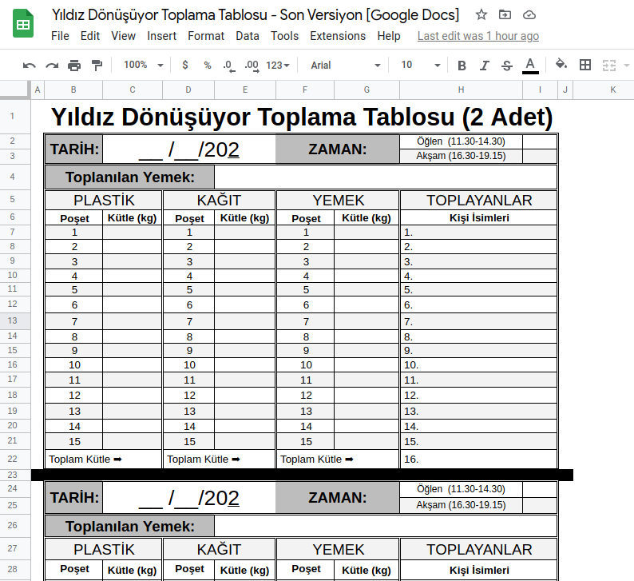

# Yıldız Dönüşüyor — Bilgiler ve Kurallar

  
   
  

_________________________________________________________

## 1. Toplama Hakkında

> Güncel değildir. Son Güncellenme Tarihi: 17.04.2019

### 1.1 Genel Bilgiler

+ Toplama, sınav haftaları hariç hafta içi her gün (öğlen ve akşam) yapılacaktır. Vize ve final haftaları toplamamız ya
  yapılmayacaktır ya da isteğe göre yapılacaktır.
+ Bu iş tamamen gönüllü işidir ve hiçbir menfaat/ karşılık beklenemez, talep edilemez.
+ Proje, yönetim kademesinde 4 kulübün (YTÜ SoS, YTÜ HayHak, YTÜ ÇEV, YTÜ Ekon) desteğiyle gerçekleşse de projeye
  katılımda hiçbir kısıt/ sınırlama yoktur. Projeye katılım için hiçbir kulübe üye olunması gerekmez.
+ Güncel Görev Paylaşım Tablosu'nda eğer o gün toplama yapması gereken kişilerden hiçbiri toplama yapamayacaksa; bu
  kişiler bu durumu bildirmekten, yerlerine biri veya birileri bulmaktan, bu buldukları kişilerin toplamayı yapıp
  yapmadığını takip etmekten sorumludurlar.
+ Projeye daha sonradan insanlar dahil olabilir ya da projede olanlar yerlerine başka birilerini bularak kalıcı olarak
  projeden ayrılabilirler.
+ Yemek, bazı öğünlerde köpeklere uygun olmaması sebebiyle toplanmayabilir. Kağıt ve plastik toplanması kesintisiz
  yapılacaktır.
+ Her türlü problem ve iletişim için "Yıldız Dönüşüyor" WhatsApp grubunun yöneticilerine ulaşılmalıdır.

### 1.2 Toplama Esnasında

+ Toplama esnasında, insanlar çok bekletilmemelidir. İnsanların tablalarını teslim ederken ekstra beklememesi için;
  tabla teslim sırasında halihazırda bekleyen kişilerden toplama yapılmalıdır. Sıranın çok fazla olduğu durumlarda
  geçici olarak toplama yapılmayabilir.
+ [Köpekler için Yemek Uygunluğu Listesi](#2-köpekler-için-yemek-uygunluğu-listesi)'nde köpekler için uygun yemekler
  listelenmiştir. Listede mevcut olmayan yemekler
  için grup yöneticilerine ulaşılabilir. Köpekler için uygun olan yiyeceklerin köpekler tarafından yenileceğinin
  garantisi yoktur. Köpeklerin bu yiyecekleri yemeyi tercih edip etmeyeceği konusunda bilgi almak için
  Hayvan Hakları Kulübü Besleme Birimi’yle irtibata geçilebilir.
+ Kuru olmayan, akacak, kokacak, kirlilik oluşturacak her türlü kağıt & plastik atık temizlenip toplanacaktır.
  Temizlenmeyecek kadar kötü olanlar (örn: çok ıslak peçete, çok kirli bardak) toplanmayacaktır.
+ Toplama yapılırken olabildiğince kibar ve olumlu bir tavır takınmak önemlidir.

### 1.3 Toplama Bitiminde

+ Toplama bitiminde toplama bölgesindeki "Toplama Tablosu" doldurulmalıdır. Toplama tablosuna “Toplayan kişiler”,
  tarih, alınan yemek ve atıkların el tartısıyla ölçülmüş ağırlıkları yazılmalıdır. Toplama tablosunun fotoğrafı Yıldız
  Dönüşüyor WhatsApp grubuna atılmalıdır. Doldurulmuş örnek bir toplama tablosu aşağıdadır:

  

+ Toplama bitiminde bölgenin temiz bırakılması, toplama kutularının en uzak köşeye ağzı kapalı bir şekilde konulması ve
  toplanılan maddelerin bulunduğu poşetlerin ağzının kapalı olduğundan emin olunması gerekmektedir.

## 2. Köpekler için Yemek Uygunluğu Listesi

### 2.1 Liste Hakkında

+ **Kategoriler**: Toplam 6 kategori bulunmaktadır:
    1. Çorba
    2. Kebap & Köfte
    3. Tavuk Yemeği
    4. Sebze Yemeği
    5. Pilav & Makarna & Börek
    6. Diğer
+ **Listenin Yapılış Amacı:** Bu liste, yemekhaneden çıkan yemeklerin köpeklerin sağlığı için güvenli olup olmadığına
  dair bir veritabanı sunmak amacıyla oluşturulmuştur.
+ **Listede İşaretleme Yapan Kişiler:** 2017-2018 YTÜ HayHak Başkanı ve birkaç diğer uzman. Listenin farklı kaynaklar
  tarafından tekrardan kontrol edilmesi önerilir.
+ **Listenin Kaynağı:** Yemek listesi, 2019 yılında http://www.sks.yildiz.edu.tr/yemekmenu/ üzerinden bir program
  yardımıyla çekilerek alınmıştır. Liste 1 Ocak 2017 ile 1 Mart 2019 arası 26 aylık zaman diliminde
  YTÜ yemekhanelerinde çıkmış tüm yemeklerin derlenmesinden oluşmaktadır.
+ **Önemli Not:** Listede "Köpekler için alınabilir" olarak işaretlenmiş her yemeğin köpekler tarafından tercih
  edileceği kesin değildir.
  Köpeklerin çok fazla tercih etmediği yiyeceklerin toplanmaması önerilmektedir.

### 2.2 Bağlantılar

+ Google Sheets bağlantısına ulaşmak için aşağıdaki görsele tıklayınız:
  
+ **Diğer
  Biçimler:** [PDF](./Köpekler%20için%20Yemek%20Uygunluğu%20Listesi/Köpekler%20için%20Yemek%20Uygunluğu%20Listesi.pdf),
  [ODS](./Köpekler%20için%20Yemek%20Uygunluğu%20Listesi/Köpekler%20için%20Yemek%20Uygunluğu%20Listesi.ods),
  [XLSX](./Köpekler%20için%20Yemek%20Uygunluğu%20Listesi/Köpekler%20için%20Yemek%20Uygunluğu%20Listesi.xlsx).

## 3. Toplama Tablosu

+ Google Sheets bağlantısına ulaşmak için aşağıdaki görsele tıklayınız:
  
+ **Diğer
  Biçimler:** [PDF](./Toplama%20Tablosu/Toplama%20Tablosu.pdf),
  [ODS](./Toplama%20Tablosu/Toplama%20Tablosu.ods),
  [XLSX](./Toplama%20Tablosu/Toplama%20Tablosu.xlsx).
+ Önceki Toplama Tablosu Versiyonları için [bağlantıya](./Toplama%20Tablosu/Önceki%20Toplama%20Tablosu%20Versiyonları)
  tıklayınız.

## 4. Tanıtım Metni ve Tanıtım Afişleri

+ **2018-19 - Proje Tanıtım Metni**: [Bağlantı](./Tanıtım%20Afişleri%20ve%20Tanıtım%20Metni/Tanıtım%20Haber%20Metni.pdf).

+ 2018-19 Bahar Dönemi - Tanıtım Afişi:

+ 2018-19 Güz Dönemi - Tanıtım Afişi:

## 5. Basında Yıldız Dönüşüyor

### 5.1 YTÜ Kampüs (23.03.2018)

+ **Haber Bağlantısı:** https://www.ytukampus.com/konu/yildiz-donusuyor-projesi-ile-geri-donusum/
+ **Haber Sayfası Ekran Görüntüsü:** [Bağlantı](./Basında%20YD/YTÜ%20Kampüs%20YD%20Haberi.pdf).

### 5.2 Sombrero Dergisi (09.06.2018)

Yazı, YTÜ öğrencileri tarafından çıkarılan Sombrero Dergi’nin üçüncü sayısında yer almıştır.

+ **Dergi Yazısı:** [Bağlantı](./Basında%20YD/Sombrero%20Dergisi%20YD%20Yazısı.pdf).

### 5.3 Çevreci Geek Ropörtajı (12.11.2018):

+ **Haber Bağlantısı:**
  https://www.cevrecigeek.com/yildiz-donusuyor-yildiz-teknik-universitesi-ogrenciler-yaklasik-1-5-ton-atigi-geri-donusturdu/
+ **Haber Sayfası Ekran Görüntüsü:** [Bağlantı](./Basında%20YD/Çevreci%20Geek%20Ropörtajı.pdf).

### 5.4 Yeşil Sektör 2019 - Yıldız Dönüşüyor Paneli (25.03.2019):

+ **Yeşil Sektör 2019 - YD Paneli İnstagram Postu:** https://www.instagram.com/p/BvbpVEEg6pD/
+ **Yeşil Sektör 2019 - YD Paneli İnstagram Postu Ekran
  Görüntüsü:** [Bağlantı](./Basında%20YD/Yeşil%20Sektör%202019%20-%20YD%20Paneli%20İnstagram%20Postu.png).

## İletişim

+ **Yıldız Dönüşüyor - Instagram:** https://instagram.com/yildizdonusuyor
+ **YTÜ Hayvan Hakları Kulübü - Instagram:** https://instagram.com/ytuhayhak
+ **YTÜ Hayvan Hakları Kulübü - LinkedIn:** https://linkedin.com/company/yildizhayvanhaklarikulubu