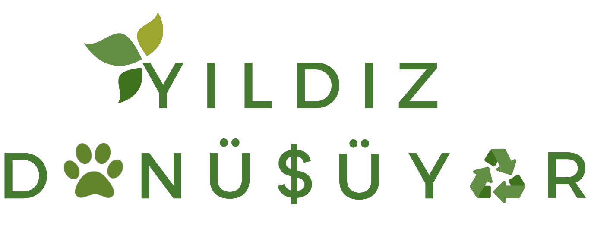

# Yıldız Dönüşüyor

  
   
  

_________________________________________________________

## Köpekler için Yemek Uygunluğu Listesi

### Köpekler için Yemek Uygunluğu Listesi - Bağlantılar

+ Google Sheets bağlantısına ulaşmak için aşağıdaki görsele tıklayınız:
  
+ Diğer
  Bağlantılar: [PDF](./Köpekler%20için%20Yemek%20Uygunluğu%20Listesi/Köpekler%20için%20Yemek%20Uygunluğu%20Listesi.pdf),
  [ODS](./Köpekler%20için%20Yemek%20Uygunluğu%20Listesi/Köpekler%20için%20Yemek%20Uygunluğu%20Listesi.ods),
  [XLSX](./Köpekler%20için%20Yemek%20Uygunluğu%20Listesi/Köpekler%20için%20Yemek%20Uygunluğu%20Listesi.xlsx).

### Köpekler için Yemek Uygunluğu Listesi - Hakkında

+ **Kategoriler**: Toplam 6 kategori bulunmaktadır:
    1. Çorba
    2. Kebap & Köfte
    3. Tavuk Yemeği
    4. Sebze Yemeği
    5. Pilav & Makarna & Börek
    6. Diğer
+ **Listenin Yapılış Amacı:** Bu liste, yemekhaneden çıkan yemeklerin köpeklerin sağlığı için güvenli olup olmadığına 
dair bir veritabanı sunmak amacıyla oluşturulmuştur.
+ **Listede İşaretleme Yapan Kişiler:** 2017-2018 YTÜ HayHak Başkanı ve birkaç diğer uzman. Listenin farklı kaynaklar
  tarafından tekrardan kontrol edilmesi önerilir.
+ **Listenin Kaynağı:** Yemek listesi, 2019 yılında http://www.sks.yildiz.edu.tr/yemekmenu/ üzerinden bir program
  yardımıyla çekilerek alınmıştır. Liste 1 Ocak 2017 ile 1 Mart 2019 arası 26 aylık zaman diliminde
  YTÜ yemekhanelerinde çıkmış tüm yemeklerin derlenmesinden oluşmaktadır.
+ **Önemli Not:** Listede "Köpekler için alınabilir" olarak işaretlenmiş her yemeğin köpekler tarafından tercih edileceği kesin değildir.
  Köpeklerin çok fazla tercih etmediği yiyeceklerin toplanmaması önerilmektedir.