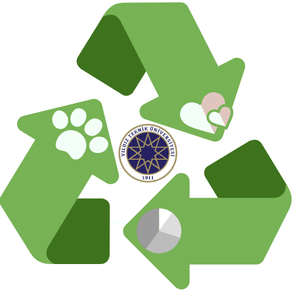
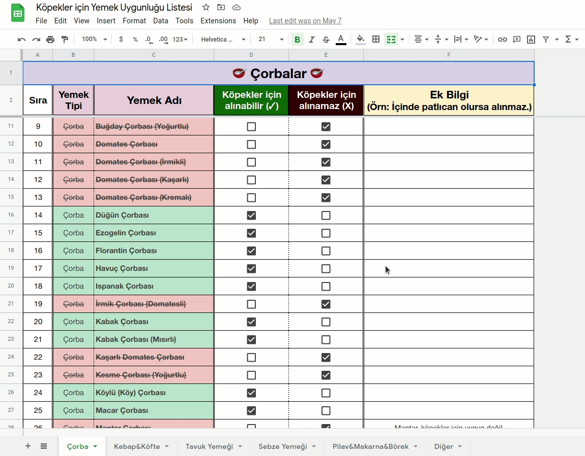
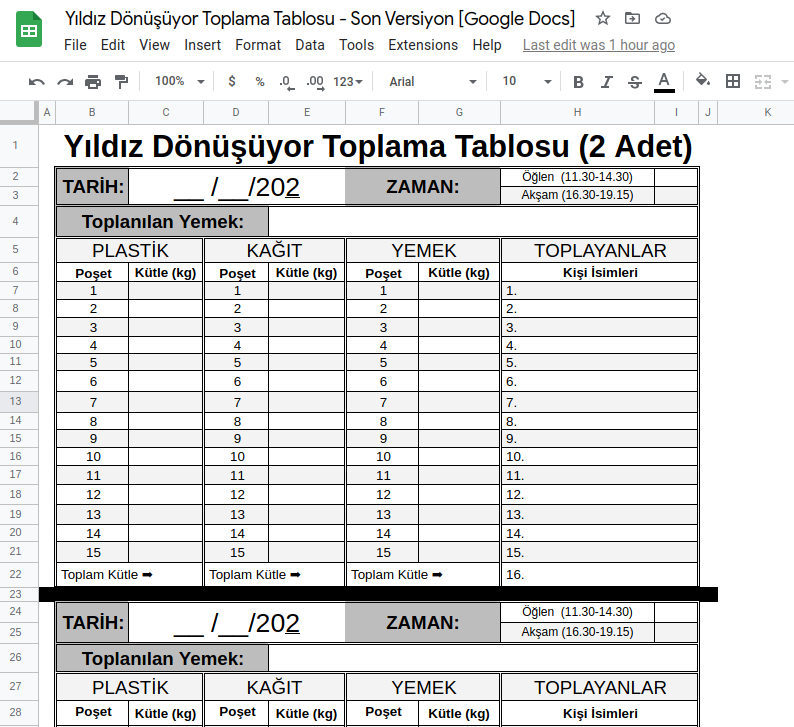
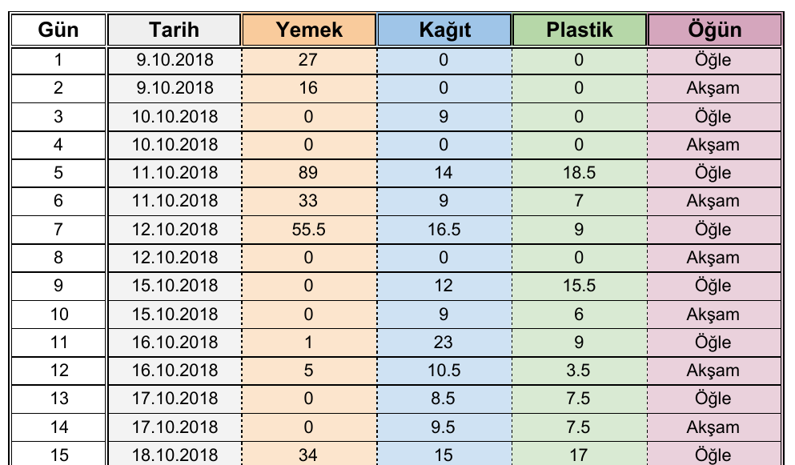
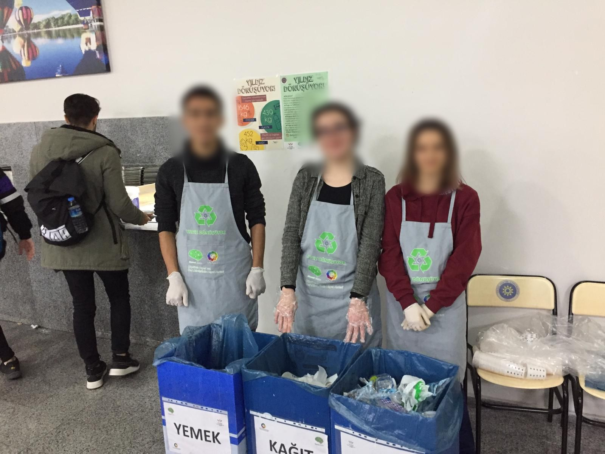
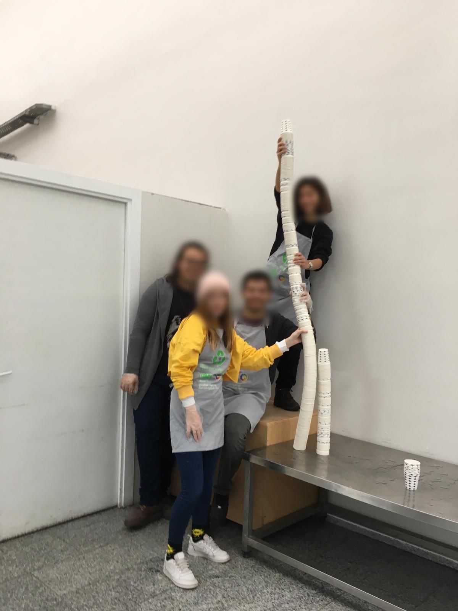
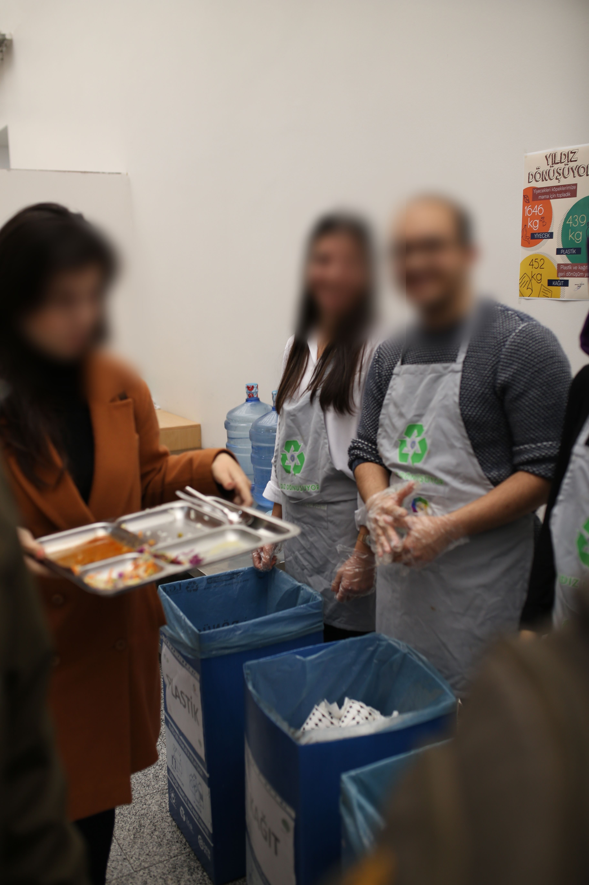
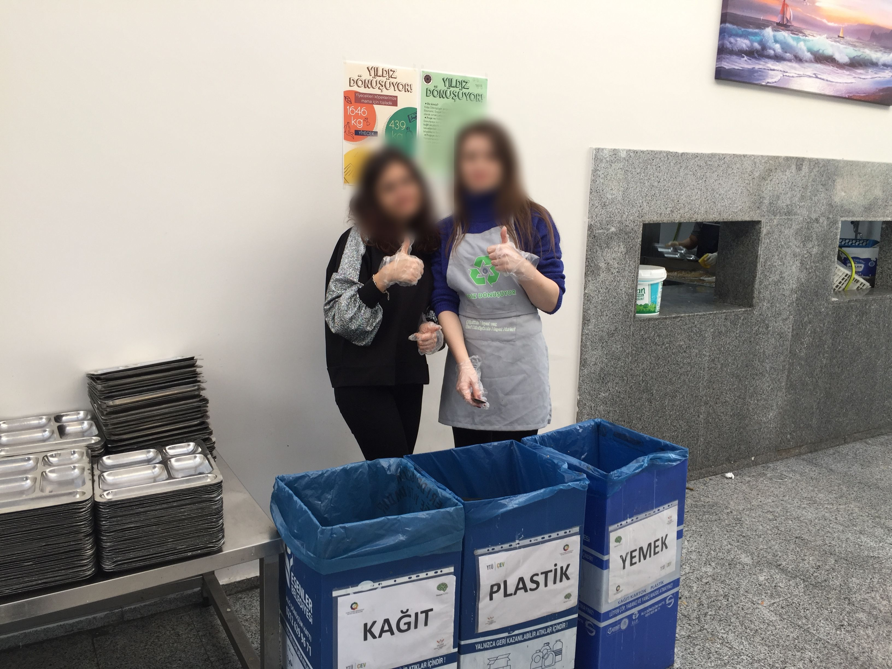

# Yıldız Dönüşüyor — Bilgiler ve Kurallar

> Yildiz Recycling - Information and Principles

  
   
  

_________________________________________________________

## Project Summary in English

Yildiz Recycling Project is a social responsibility project aiming to save the environment, raise awareness for
recycling and regain uneaten foods.

+ Had a huge impact in extent of recycling, animal feeding, money saving.
+ Regained more than 4 tons of uneaten and edible food for dogs in 6 months.
+ Recycled more than 3 tons of paper and more than 3 tons of plastic in 6 months.
+ Kept the record of each collected material including food, plastic, and paper.
+ Delivered all uneaten healthy food to 150 stray dogs living in Yildiz Technical University Davutpaşa Campus.

## 0. Giriş

YTÜ Ekonomi Kulübü ve YTÜ Hayvan Hakları Kulübü'nün başlatmış olduğu "Yıldız Dönüşüyor" adlı proje bu konularda
farkındalık yaratarak hem kampüs hayvanlarını doyuruyor hem de geri dönüşüme katkı sağlıyor. Mart 2018'de başlayan
projeyle ilk önce Yıldız Teknik Üniversitesi Davutpaşa kampüsü içerisindeki köpeklerin doyması ve kağıt/plastik geri
dönüşümü yapılması hedeflendi. Proje; başladığı günden itibaren çok farklı kulüplerdeki ve çok farklı bölümlerdeki
birçok Yıldız Teknik Üniversitesi öğrencisinin desteğiyle büyüdü. Yemekhanede yemek tablalarının üstündeki köpeklerin
yiyebileceği yemekler toplanıp kampüs beslemesi yapan arkadaşlara veriliyor ve kağıt/ plastik geri dönüşümleri Esenler
Belediyesi'nin geri dönüşüm aracına veriliyor.

## 1. Toplama Hakkında

> Güncel değildir. Son Güncellenme Tarihi: 17.04.2019

### 1.1 Genel Bilgiler

+ Toplama, sınav haftaları hariç hafta içi her gün (öğlen ve akşam) yapılacaktır. Vize ve final haftaları toplamamız ya
  yapılmayacaktır ya da isteğe göre yapılacaktır.
+ Bu iş tamamen gönüllü işidir ve hiçbir menfaat/ karşılık beklenemez, talep edilemez.
+ Proje, yönetim kademesinde 4 kulübün (YTÜ SoS, YTÜ HayHak, YTÜ ÇEV, YTÜ Ekon) desteğiyle gerçekleşse de projeye
  katılımda hiçbir kısıt/ sınırlama yoktur. Projeye katılım için hiçbir kulübe üye olunması gerekmez.
+ Güncel Görev Paylaşım Tablosu'nda eğer o gün toplama yapması gereken kişilerden hiçbiri toplama yapamayacaksa; bu
  kişiler bu durumu bildirmekten, yerlerine biri veya birileri bulmaktan, bu buldukları kişilerin toplamayı yapıp
  yapmadığını takip etmekten sorumludurlar.
+ Projeye daha sonradan insanlar dahil olabilir ya da projede olanlar yerlerine başka birilerini bularak kalıcı olarak
  projeden ayrılabilirler.
+ Yemek, bazı öğünlerde köpeklere uygun olmaması sebebiyle toplanmayabilir. Kağıt ve plastik toplanması kesintisiz
  yapılacaktır.
+ Her türlü problem ve iletişim için "Yıldız Dönüşüyor" WhatsApp grubunun yöneticilerine ulaşılmalıdır.

### 1.2 Toplama Esnasında

+ Toplama esnasında, insanlar çok bekletilmemelidir. İnsanların tablalarını teslim ederken ekstra beklememesi için;
  tabla teslim sırasında halihazırda bekleyen kişilerden toplama yapılmalıdır. Sıranın çok fazla olduğu durumlarda
  geçici olarak toplama yapılmayabilir.
+ [Köpekler için Yemek Uygunluğu Listesi](#2-köpekler-için-yemek-uygunluğu-listesi)'nde köpekler için uygun yemekler
  listelenmiştir. Listede mevcut olmayan yemekler
  için grup yöneticilerine ulaşılabilir. Köpekler için uygun olan yiyeceklerin köpekler tarafından yenileceğinin
  garantisi yoktur. Köpeklerin bu yiyecekleri yemeyi tercih edip etmeyeceği konusunda bilgi almak için
  Hayvan Hakları Kulübü Besleme Birimi’yle irtibata geçilebilir.
+ Kuru olmayan, akacak, kokacak, kirlilik oluşturacak her türlü kağıt & plastik atık temizlenip toplanacaktır.
  Temizlenmeyecek kadar kötü olanlar (örn: çok ıslak peçete, çok kirli bardak) toplanmayacaktır.
+ Toplama yapılırken olabildiğince kibar ve olumlu bir tavır takınmak önemlidir.

### 1.3 Toplama Bitiminde

+ Toplama bitiminde toplama bölgesindeki "Toplama Tablosu" doldurulmalıdır. Toplama tablosuna “Toplayan kişiler”,
  tarih, alınan yemek ve atıkların el tartısıyla ölçülmüş ağırlıkları yazılmalıdır. Toplama tablosunun fotoğrafı Yıldız
  Dönüşüyor WhatsApp grubuna atılmalıdır. Doldurulmuş örnek bir toplama tablosu aşağıdadır:

  

+ Toplama bitiminde bölgenin temiz bırakılması, toplama kutularının en uzak köşeye ağzı kapalı bir şekilde konulması ve
  toplanılan maddelerin bulunduğu poşetlerin ağzının kapalı olduğundan emin olunması gerekmektedir.

## 2. Köpekler için Yemek Uygunluğu Listesi

### 2.1 Liste Hakkında

+ **Kategoriler**: Toplam 6 kategori bulunmaktadır:
    1. Çorba
    2. Kebap & Köfte
    3. Tavuk Yemeği
    4. Sebze Yemeği
    5. Pilav & Makarna & Börek
    6. Diğer
+ **Listenin Yapılış Amacı:** Bu liste, yemekhaneden çıkan yemeklerin köpeklerin sağlığı için güvenli olup olmadığına
  dair bir veritabanı sunmak amacıyla oluşturulmuştur.
+ **Listede İşaretleme Yapan Kişiler:** 2017-2018 YTÜ HayHak Başkanı ve birkaç diğer uzman. Listenin farklı kaynaklar
  tarafından tekrardan kontrol edilmesi önerilir.
+ **Listenin Kaynağı:** Yemek listesi, 2019 yılında http://www.sks.yildiz.edu.tr/yemekmenu/ üzerinden bir program
  yardımıyla çekilerek alınmıştır. Liste 1 Ocak 2017 ile 1 Mart 2019 arası 26 aylık zaman diliminde
  YTÜ yemekhanelerinde çıkmış tüm yemeklerin derlenmesinden oluşmaktadır.
+ **Önemli Not:** Listede "Köpekler için alınabilir" olarak işaretlenmiş her yemeğin köpekler tarafından tercih
  edileceği kesin değildir.
  Köpeklerin çok fazla tercih etmediği yiyeceklerin toplanmaması önerilmektedir.

### 2.2 Bağlantılar

+ Google Sheets bağlantısına ulaşmak için aşağıdaki görsele tıklayınız:

+ **Diğer
  Biçimler:** [PDF](./Köpekler%20için%20Yemek%20Uygunluğu%20Listesi/Köpekler%20için%20Yemek%20Uygunluğu%20Listesi.pdf),
  [ODS](./Köpekler%20için%20Yemek%20Uygunluğu%20Listesi/Köpekler%20için%20Yemek%20Uygunluğu%20Listesi.ods),
  [XLSX](./Köpekler%20için%20Yemek%20Uygunluğu%20Listesi/Köpekler%20için%20Yemek%20Uygunluğu%20Listesi.xlsx).

## 3. Toplama Tablosu

+ Google Sheets bağlantısına ulaşmak için aşağıdaki görsele tıklayınız:
  
+ **Diğer
  Biçimler:** [PDF](./Toplama%20Tablosu/Toplama%20Tablosu.pdf),
  [ODS](./Toplama%20Tablosu/Toplama%20Tablosu.ods),
  [XLSX](./Toplama%20Tablosu/Toplama%20Tablosu.xlsx).
+ Önceki Toplama Tablosu Versiyonları için [bağlantıya](./Toplama%20Tablosu/Önceki%20Toplama%20Tablosu%20Versiyonları)
  tıklayınız.

## 4. Tanıtım Metinleri ve Toplama Afişleri

+ **2018-19 - Proje Tanıtım Haber Metni**:
  [Bağlantı](./Tanıtım%20Afişleri%20ve%20Tanıtım%20Metni/Tanıtım%20Haber%20Metni.pdf).

+ **2018-19 - Proje Tanıtım Metni**:
  [Bağlantı](./Tanıtım%20Afişleri%20ve%20Tanıtım%20Metni/Proje%20Tanıtım%20Yazısı.pdf).

+ **2018-19 Bahar Dönemi - Toplama Afişi 1:**

  

+ **2018-19 Bahar Dönemi - Toplama Afişi 2:**

  

+ **2018-19 Bahar Dönemi - Toplama Afişi 3:**

  

+ **2018-19 Bahar Dönemi - Toplama Afişi 4:**

  

+ **2018-19 Güz Dönemi - Tanıtım Afişi:**

  

+ **2018-19 Güz Dönemi - Toplama Afişi:**

  

## 5. Toplama Verileri

+ 2017 - 2018 Güz Dönemi (9.10.2018 - 11.1.2019) arası kümülatif toplama verileri için aşağıdaki görsele tıklayınız:

  

+ 2017 - 2018 Güz Dönemi (9.10.2018 - 08.03.2019) arası haftalık toplama verileri için tıklayınız:
  [2017-18 Güz - Haftalık Toplama Verileri.pdf](./Toplama%20Verileri/2017-18%20Güz%20-%20Haftalık%20Toplama%20Verileri.pdf).

+ 2017 - 2018 Bahar Dönemi (14.03.2018 - 11.05.2018) kümülatif toplama verileri ve infografikler için tıklayınız:
  [2017-18 Bahar - Kümülatif Toplama Verileri.pdf](./Toplama%20Verileri/2017-18%20Bahar%20-%20Kümülatif%20Toplama%20Verileri.pdf).

## 6. Basında Yıldız Dönüşüyor

### 6.1 YTÜ Kampüs (23.03.2018)

+ **Haber Bağlantısı:** https://www.ytukampus.com/konu/yildiz-donusuyor-projesi-ile-geri-donusum/
+ **Haber Sayfası Ekran Görüntüsü:** [Bağlantı](./Basında%20YD/YTÜ%20Kampüs%20YD%20Haberi.pdf).

### 6.2 Sombrero Dergisi (09.06.2018)

Yazı, YTÜ öğrencileri tarafından çıkarılan Sombrero Dergi’nin üçüncü sayısında yer almıştır.

+ **Dergi Yazısı:** [Bağlantı](./Basında%20YD/Sombrero%20Dergisi%20YD%20Yazısı.pdf).

### 6.3 Çevreci Geek Ropörtajı (12.11.2018):

+ **Haber Bağlantısı:**
  https://cevrecigeek.com/yildiz-donusuyor-yildiz-teknik-universitesi-ogrenciler-yaklasik-1-5-ton-atigi-geri-donusturdu/
+ **Haber Sayfası Ekran Görüntüsü:** [Bağlantı](./Basında%20YD/Çevreci%20Geek%20Ropörtajı.pdf).

### 6.4 Yeşil Sektör 2019 - Yıldız Dönüşüyor Paneli (25.03.2019):

+ **Yeşil Sektör 2019 - YD Paneli İnstagram Postu:** https://www.instagram.com/p/BvbpVEEg6pD/
+ **Yeşil Sektör 2019 - YD Paneli İnstagram Postu Ekran
  Görüntüsü:** [Bağlantı](./Basında%20YD/Yeşil%20Sektör%202019%20-%20YD%20Paneli%20İnstagram%20Postu.png).

## 7. Toplamalardan Fotoğraflar

Kişisel verilerin korunması gereğince yüzler bulanıklaştırılmıştır. Diğer fotoğraflar ve videolar için bana
ulaşabilirsiniz.

  
  
  
  

## 8. Fikir Havuzu ve Gelecek Planları

+ Yemek dolabının (siyah dolabın) yerinin değiştirilmesi, böylece HayHak kulüp odasına girenler ilk siyah dolabı kontrol
  edecekler.
+ Bu [önlükler](images/önlükler_kutular.jpg) gibi yeni YD önlüklerinin bastırılması ve 1-2 ayda bir düzenli olarak tüm
  önlüklerin yıkanması.
+ Bu [kutular](images/önlükler_kutular.jpg) gibi kutuların geri gelmesi sağlanabilir ver kutulara özel yazılar (örn. "
  Kağıt", "Plastik", "Yemek") yeniden bastırılabilir.
+ YD Beşiktaş kolunu başlatmak: Resmi izin, koordinatör belirleme, YD Beşiktaş için Whatsapp grubu açma.
+ Kalite Verimlilik Kulübünü ve diğer ilgili kulüpleri projeye katmak.
+ Yemekhanede peçetelikler üzerine insanların masalarda atık bırakmaması, dönüşüme gelirken atıklarını ayırmalarını
  söyleyen yazının/afişin yapıştırılması.
+ Köpekler için Yemek Uygunluğu Listesi’nde bulunan “uygun” yemeklerin köpekler tarafından tercih edilip edilmeyeceği
  tam olarak bilinmemekte. Bunun için toplanılması uygun olan yemeklerin köpekler tarafından tercih edilip
  edilmeyeceğini gösteren bir sütun daha eklenebilir. Bunu yaparken YTÜ HayHak Besleme birimi ile iletişime geçilebilir.
+ **Yemek Atıkların Kompostlaştırılması:** Köpeklere uygun olmayan yemeklerin de toplanıp “kompost” hale getirilerek
  gübre olarak okulda kullanabilmesi.
+ **Sigara İzmaritine Karşı Savaş:** akılcı bir eylem, sigara izmaritlerinin sayılıp olay yerinin fotoğrafını koyup
  paylaşma işi, ODTÜ’de olduğu gibi.
+ **YD Yılsonu Sergisi:** Kağıt ve plastik atıklardan sanat eserleri oluşturarak bunu yıl sonunda okulda uygun bir
  alanda sergilemek. Bunun için diğer kulüplerle de işbirliği yapılabilir.
+ **YD Tanıtım Filmi**
+ **Trash Challenge:** Çöpler toplanmadan önce/sonra fotoğraf çekilip
  birleştirilmesi. [Linkte](https://trashtagchallenge.com/) örnekler mevcut. Challenge’da kulüpler/gruplar birbirlerine
  meydan okuyarak rakip olabilecek. Trash Challenge, 9gag.com gibi caps paylaşılan sitelerde popüler olan bir challenge.
  Bu challenge vasıtasıyla, projenin yurtiçi ve yurtdışı birçok yere ulaşma imkanı olabilir.
+ **Barınaklar için Atık Kağıt Çalışması:** Barınaklarda kağıt atıkların önemi büyük. Kağıt atıklar, barınaklarda kağıt
  imha makinesine (paper shredder) sokularak parça parça ediliyor ve bu parçalar köpeklerin bulunduğu yere seriliyor.
  Böylece hayvanların tuvaletlerini yaptıktan sonra yerlerin temizlenmesi çok kolay oluyor. YD’de dergi-gazete-kağıt
  gibi atıkların toplanması ve Hayvan Hakları Kulübü’nün de yardımıyla böyle bir çalışma yürütülebilir. Kağıt atıklar;
  okuldaki tüm bölüm sekreterliklerinden, tüm kırtasiyelerden talep edilerek toplanabilir. Önceden bu şekilde
  toplanmıştı. Ayrıca Üsküdar Belediyesi 2018’de Hayvan Hakları Kulübü’ne kulübün onlara atık kağıt sağlaması
  karşılığında ilaç yardımı yapabileceğini söylemişti.
+ **Müsvedde Kağıt Çalışması:** Tek tarafı boş olan A4’lerin toplanacağı bir kutu konarak buradan insanların not almak
  için veya ders çalışmak için kullanacakları müsvedde kağıtlar temin etmesi sağlanabilir. Kağıtlar sekreterlik ve
  kırtasiyelerden sağlanabilir. Bu 2018/2019 ilk döneminde yapıldı, [linkte](images/müsvedde_kağıt_yazısı.jpeg)
  mevcut. Kutu üstüne yazılan yazı, bu [linkte](./images/Müsvedde%20Kağıt%20Geri%20Dönüşümü%20için%20Yazı.jpg).
+ Önceden olduğu gibi ([eski katılım belgesi #1](./images/katılım_belgesi_1.jpg),
  [eski katılım belgesi #2](./images/katılım_belgesi_2.jpg)) belli bir sayıda (örneğin en az on kere)
  toplama yapana katılım belgesi (sertifika) verilebilir.
+ Roll-up banner bastırılabilir.
+ Çevre Kulübü ve Çevre Mühendisliği'nin Yeşil Sektör etkinliğinde Yıldız Dönüşüyor ile bardaklardan tasarım
  yapılabilir.
+ Bu işler için sponsor aranabilir: Eldiven ve ıslak mendil tedariği, önlük basımı, roll up banner
+ Temizlik ve basım malzemeleri için destekçi kulüpler arasında ortak bütçe yapılabilir. Mesela her kulüp aylık 500 TL
  katkı sağlayabilir.
+ YTÜ Sanat Tasarım Fakültesi ile konuşup toplanan atıklardan (kağıt, bardak, plastik, vs.) atölye düzenlenerek sanat
  eserleri oluşturmak.
+ QR kodlu afişle insanların projeye katılımının hızlandırılması ve proje hakkında hızlı bilgi alınması sağlanabilir.
+ Çevre Kulübü ile geri dönüşüm fabrikası ziyaret edilebilir.
+ Diğer üniversitelerin Yıldız Dönüşüyor'a başlaması için e-posta atılabilir.

## İletişim

+ **Yıldız Dönüşüyor - Instagram:** https://instagram.com/yildizdonusuyor
+ **YTÜ Hayvan Hakları Kulübü - Instagram:** https://instagram.com/ytuhayhak
+ **YTÜ Hayvan Hakları Kulübü - X (Old Twitter):** https://x.com/ytuhayhak
+ **YTÜ Hayvan Hakları Kulübü - LinkedIn:** https://linkedin.com/company/yildizhayvanhaklarikulubu
+ **YTÜ Hayvan Hakları Kulübü - Web Sayfası:** https://ytuhayhak.carrd.co
+ **YTÜ Hayvan Hakları Kulübü - E-Posta:** [ytuhayhak@gmail.com](mailto:ytuhayhak@gmail.com)
+ **YTÜ Hayvan Hakları Kulübü - Diğer Bağlantılar:** https://linktr.ee/ytuhayhak
+ **YD 2017 - 2018 Organizasyon Komitesi:**
    - Berk Sudan (Hayvan Hakları Yönetim Kurulu Üyesi & Proje Sorumlusu #1)
    - Yusuf Şebin (Ekonomi Kulübü Yönetim Kurulu Başkanı & Proje Sorumlusu #2)
+ **YD 2018 - 2019 Organizasyon Komitesi:**
    - Hatice Akca (Hayvan Hakları Yönetim Kurulu Üyesi & Proje Sorumlusu #1)
    - Ezgi Gezen (SoS Yönetim Kurulu Üyesi & Proje Sorumlusu #2)
    - Zeynep Orak (Çevre Kulübü Yönetim Kurulu Üyesi & Proje Sorumlusu #3)
    - Fatma Uzun (Ekonomi Kulübü Yönetim Kurulu Üyesi & Proje Sorumlusu #4)
    - Selin Üstündağ (Ekonomi Kulübü Yönetim Kurulu Başkanı)
    - İrem Nur Yılmaz (Hayvan Hakları Yönetim Kurulu Başkanı)
    - Berkay Kömür (Çevre Kulübü Başkanı)
    - Esra Taşçı (Hayvan Hakları Yönetim Kurulu Üyesi & Besleme Sorumlusu)
    - Berk Sudan (Proje Danışmanı)